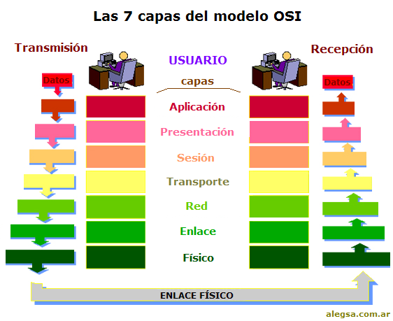

# Conceptos básicos de Azure
## 
Computo  
Un equipo de computo es un dispositivo electrónico que cuenta con una tarjeta madre que es la que controla los demás componentes del equipo, un procesador, una memoria RAM (almacenamiento temporal de la información), Memoria de almacenamiento (donde se guarda la infomación del usuario y del sistema) y sofrware que es la conección entre el usuario y el equipo, gracias al cual el usuario puede asignar órdenes al equipo para realizar procesos. 

Esta es la estructura base de un equipo de computo, dependiendo del tipo de equipo puede estar acompañando en un teclado, ratón y monitor o solamente una pantalla tactil que suple las funciones del teclado y ratón como es el caso de los celulares y tabletas. 

## 
Comunicación entre equipos de computo  
Los equipos de computo pueden comunicarse o transmitir información principalmente a través de señales infrarojas (en el pasado), por señales de radio bluethood y redes (eternet y wifi). Además para que los equipos de computo se puedan comunicar requierende un lenguaje o protocolo de comunicación 

La comunicación por medio de redes es la que permite la transferencia de datos con la mayor velocidad y es la más utilizada en la comunicación entre computadoras. 

El lenguaje de comunicación se conoce como TCP/IP (Protocolo de Control de Transmisión/Protocolo de Internet). Mediante este leguaje se pueden transferir datos entre equipos de computo dentro de una misma infraestructura 8red local) o servidor y por medio de internet entre diferentes infraestructuras o servidores los cuales pueden estar ubicados incluso continentes diferentes, además esta comunicación permite que de manera remota se pueda operar un equipo de computo desde otra ubicación física 

El modelo OSI explica las redes de comunicación en 7 capas o niveles: 

- **Nivel físico**: Señal y transmisión binaria 

- **Nivel de enlace de datos**: direccionamiento físico 

- **Nivel red**: Determinación de ruta e IP (direccionamiento lógico) 

- **Nivel de transporte**: conexión extremo- extremo y fiabilidad de los datos 

- **Nivel sesión**: comunicación entre dispositivos de la red 

- **Nivel de Presentación**: Representación de los datos 

- **Nivel aplicación**: servicios de red a aplicaciones 

## 
 Nube  
Conocido como el computo en la nube, es un sevicio que permite la disponibilidad y uso de recursos de almacenamiento y capacidad de computo, como memoria RAM y procecadores, de forma remota desde otro dispositivo de computo mediante el uso de redes. 

Los recursos y servicios que ofrecen las nubes son impresionantes y le permiten al usuario disponer de datos sin tener que almacenarlos físicamente en su dispositivo, además permite de manera sencilla y rápida el compartir esta información, también funciona como un respaldo de esta información. 

Pero el almacenamiento no es lo único, también se puede usar de forma remota que equipos de computo con mayor capacidad de procesamiento y memoria sin tener que comprar una computadora muy potente, puesto que se puede rentar por un determinado tiempo reduciendo de esta forma los gastos de capital. 

Por último otro de los servición de la nube es el uso de aplicaciones especializadas. 

Existen tres tipos de nubes: 

- tipos de nubes
- Servicios que ofrece Azure
- infraestructura de Azure
- Cuentas y facturación

## Servicios Azure
- Servicios de infraestructura
- Servicios de plataforma
- Servicios de Seguridad
- Zonas de disponibilidad

